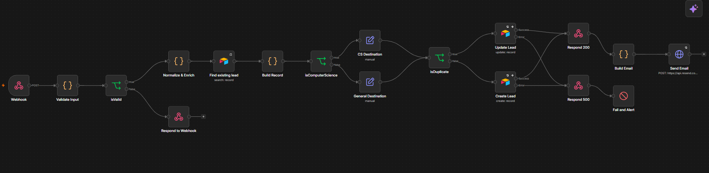
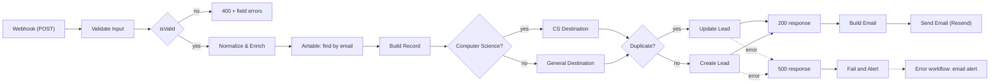
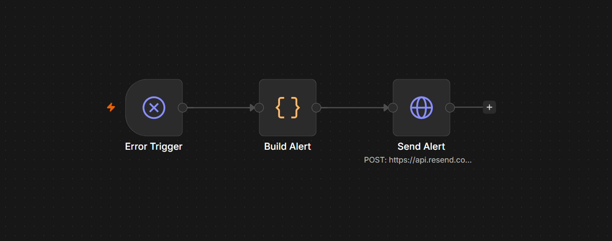
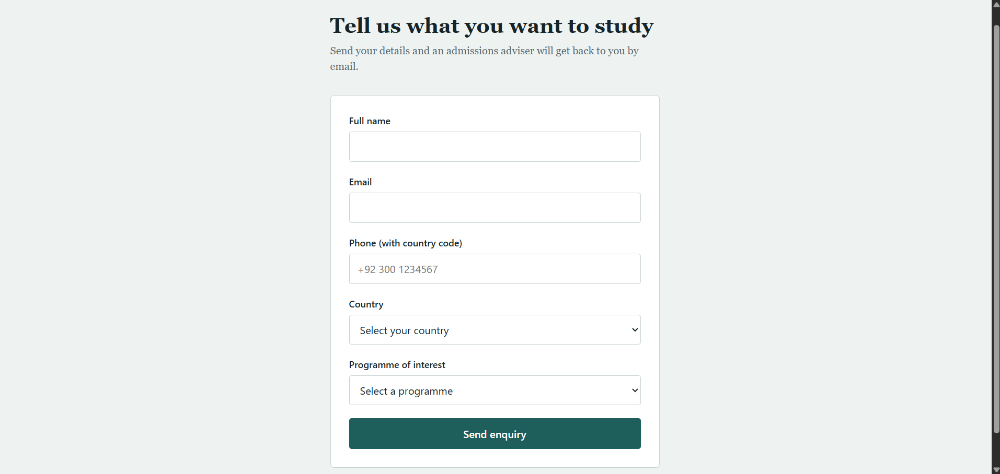

# Lead Intake & Routing Workflow (n8n)

An n8n workflow for an education client. Student enquiries from a web form are **validated, normalised, deduplicated, routed by programme, stored in Airtable, and announced by email**. If anything fails on the write path, a separate error workflow alerts a human, so a lead never disappears silently.



## Highlights

- **Clean rejection of bad input.** Malformed submissions get an HTTP `400` with a field-level `errors` array instead of a crash.
- **Deduplication on email.** The same person submitting twice updates one record (with a submission counter and a "what changed" diff) instead of creating two.
- **Routing by programme.** Computer Science enquiries go to one team, everything else to another, each with its own recipient and subject tag.
- **Enrichment.** Country aliases (`pk`, `uae`, `usa`) are normalised, a region is added, phones are cleaned, and casing is fixed without breaking names like *McDonald*.
- **No silent failures.** Airtable writes retry, then fall through to a `500` response and a dedicated error workflow that emails an alert.
- **Tested.** A Python smoke-test script exercises the live webhook.

## How it works



| Stage | What happens |
|---|---|
| **Validate** | Trims and strips HTML from inputs, then checks name (max 100 chars), email (format, max 254), phone (7-15 digits, phone characters only), country, and programme. If "Other" is chosen, the free-text field is required. |
| **Normalise & enrich** | Maps country names and aliases to a canonical name plus a **region**, cleans the phone (`00` becomes `+`), fixes casing only when input is all-lower or all-upper, and derives the **route**. Typing "computer science" under "Other" still routes to CS. |
| **Deduplicate** | Airtable search on the lowercased email. A match flips the record to an update, keeps `First Submitted`, increments `Submission Count`, and records what changed. |
| **Route** | `Computer Science` goes to *Computer Science Admissions* (`[CS]` tag). Everything else goes to *General Admissions* (`[GEN]`). |
| **Persist** | Create or Update in Airtable, each with retry on failure (2s wait) and a dedicated error output. |
| **Respond & notify** | Returns `200` to the form, then sends an HTML summary email via Resend, including a "changes since last submission" list for returning leads. |
| **Fail loudly** | A failed write returns `500` to the form and hits a *Stop and Error* node, which triggers the error workflow. |

### Error workflow



`Error Trigger` → `Build Alert` → `Send Alert`. It receives the failed execution's details (workflow, failed node, error message, execution link) and emails them, so whoever is on call knows what broke and where.

### The form



The form posts JSON to the webhook. This repo focuses on the workflow, so the form is shown for context.

## API contract

`POST /webhook/lead-intake` with `Content-Type: application/json`

```json
{
  "name": "Ayesha Khan",
  "email": "ayesha.khan@example.com",
  "phone": "+92 300 1234567",
  "country": "Pakistan",
  "programme": "Computer Science",
  "programme_other": ""
}
```

| Outcome | Status | Body |
|---|---|---|
| New lead saved | `200` | `{"success": true, "message": "Thank you, we have received your enquiry."}` |
| Returning lead updated | `200` | `{"success": true, "message": "Your details have been updated. Thank you."}` |
| Validation failed | `400` | `{"success": false, "message": "Validation failed", "errors": [{"field": "email", "message": "Email format is invalid"}]}` |
| Write failed | `500` | `{"success": false, "message": "We could not save your enquiry right now. Please try again in a few minutes."}` |

## Airtable schema

Create a table with these fields:

| Field | Type |
|---|---|
| Email | Single line text |
| Name | Single line text |
| Phone | Single line text |
| Country | Single line text |
| Region | Single line text |
| Programme | Single line text |
| Route | Single select (`Computer Science`, `General`) |
| First Submitted | Date (include time) |
| Last Submitted | Date (include time) |
| Submission Count | Number (integer) |

## Setup

1. **Import** both files from [`workflows/`](workflows) into n8n (*Workflows → Import from file*).
2. **Create credentials**
   - *Airtable Personal Access Token* with `data.records:read` and `data.records:write` on your base.
   - *Header Auth* for Resend: name `Authorization`, value `Bearer <your Resend API key>`.
3. **Re-select** the Airtable base and table in the three Airtable nodes, and attach your credentials to the Airtable and Resend HTTP nodes.
4. **Set recipients.** Replace `youremail@example.com` in the `CS Destination` and `General Destination` nodes and in the `Build Alert` node of the error workflow.
5. **Link the error workflow.** In the main workflow, open *Settings → Error Workflow* and select *Lead Intake - Error Alert*.
6. **Activate** the main workflow and point your form at the production webhook URL.

> Resend's `onboarding@resend.dev` sender only delivers to your own Resend account email until you verify a domain.

## Testing

Install the dependency and run the smoke tests against your webhook:

```bash
pip install -r requirements.txt
python tests/test_webhook.py https://<your-n8n-host>/webhook/lead-intake
```

The script checks that a valid submission is accepted, that resubmitting the same email is treated as an update, and that a bad email, missing name, bad phone, and incomplete "Other" programme each return a clean `400` naming the right field. The valid and duplicate tests write a real Airtable record and send a real email, using a fresh `test+<timestamp>@example.com` address each run.

You can also try the payloads in [`sample-payloads/`](sample-payloads) with curl:

```bash
curl -X POST <WEBHOOK_URL> -H "Content-Type: application/json" -d @sample-payloads/valid.json
curl -X POST <WEBHOOK_URL> -H "Content-Type: application/json" -d @sample-payloads/invalid-email.json
```

## Design notes

- **Dedup key is the lowercased email**, and the search formula escapes single quotes so odd input can't break the Airtable query.
- **The webhook responds before the email is sent.** The user gets a fast answer once the record is safe. If the email step later fails, the error workflow still fires.
- **Credentials never live in the workflow JSON.** The exported files reference credential slots only, and recipient addresses are placeholders.
- **User input is HTML-escaped** before it goes into the notification email.

## Known limitations

- **Dedup race condition.** Two near-simultaneous submissions with the same email can both miss the search and create two records. A unique constraint or a queue would fix this at higher volume.
- **Starter country list.** Countries outside the built-in list get the region `Unmapped`.
- **Open CORS.** The webhook allows any origin (`*`). Restrict it to the form's domain in production.
- **Alert contains the lead's email.** The `Fail and Alert` message includes the submitter's email for debugging, so it appears in alert emails and the n8n execution log.

## Repository structure

```
.
├── workflows/
│   ├── lead-intake-and-routing.json   # main workflow
│   └── error-alert-handler.json       # error workflow
├── sample-payloads/                   # example requests
├── tests/test_webhook.py              # smoke tests for the live webhook
├── screenshots/                       # images used in this README
└── requirements.txt
```

## Tech

n8n (self-hosted in Docker) · Airtable · Resend · JavaScript Code nodes · Python (`requests`) for tests

## Author

Built by [Ayaan Nadeem](https://github.com/AyaanNadeem12).

Released under the [MIT License](LICENSE).
